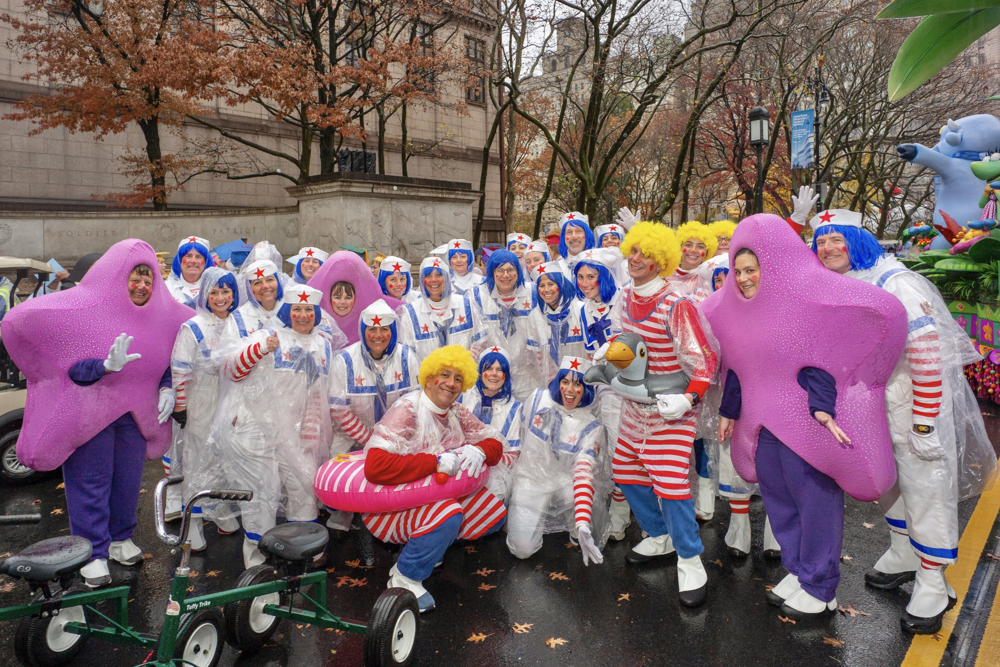
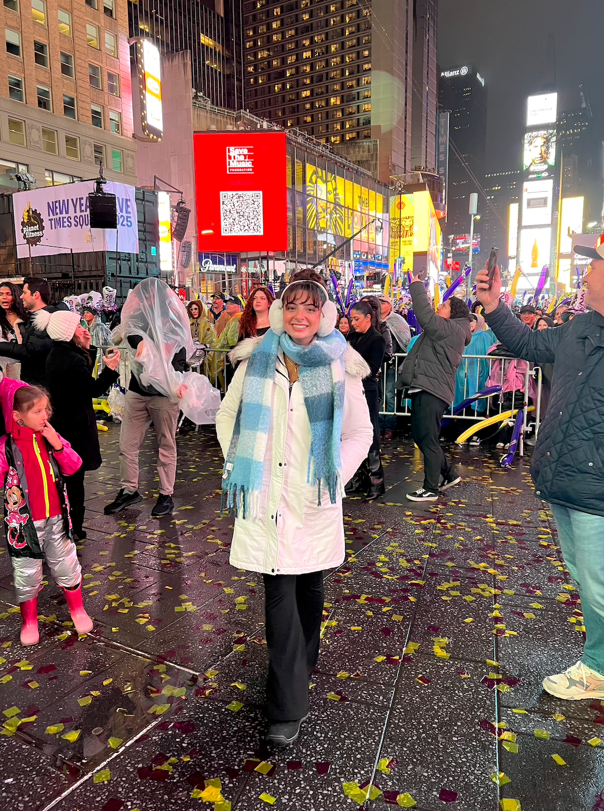

## About me! 

Hi! My name is Nicole Criscuolo. I am a first-year master's student at Columbia University Mailman School of Public Health. I was born and raised in New Jersey and have always loved visiting NYC, especially during the holidays. 

My favorite thing to do in the city is try new restaurants. Here you can check out some [plots](plots.html) on NYC restaurant scores. Some other cool things I've done in the city are walk in the Macy's Thanksgiving Day Parade and watch the ball drop in Times Square on New Year's Eve. Check out some photos below!

## Photos

 

